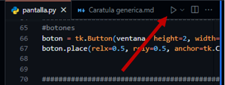
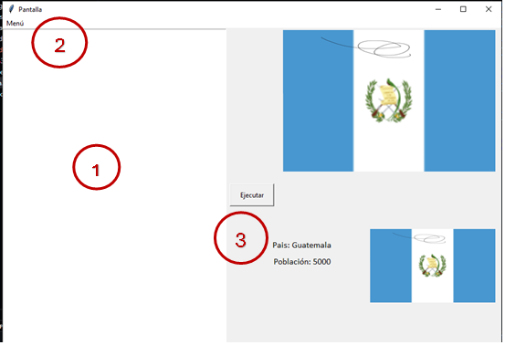

# **INTRODUCCIÓN**
- # **Objetivo**
Proporcionar ayuda sobre el uso correcto de la aplicación por medio de instrucciones y pasos específicos que se deben seguir para poder lograr el objetivo del programa.

- # **Requerimientos**

- **Procesador**: 1.6 GHz o más rápido.
- **Memoria RAM**: Al menos 1 GB.
- **Espacio en disco**: Menos de 500 MB para la instalación.

**Sistemas Operativos Compatibles**

- **Windows**: Windows 10 y 11 (64 bits).
- **macOS**: Versiones con soporte de actualizaciones de seguridad de Apple (típicamente la versión más reciente y las dos anteriores).
- **Linux**:
  - Debian: Ubuntu Desktop 20.04, Debian 10.
  - Red Hat: Red Hat Enterprise Linux 8, Fedora 36.

**Requisitos Adicionales para Linux**

- **GLIBCXX**: Versión 3.4.25 o posterior.
- **GLIBC**: Versión 2.28 o posterior

# **OPCIONES DEL SISTEMA**
- # **Ingreso a la aplicación**
En Visual Studio Code, se debe ubicar la carpeta del programa y abrirla, ahí se mostrarán todos los archivos que contiene la carpeta, al dar clic al de extensión .py se abrirá el archivo

Al ya tener el archivo podrá ejecutarlo directamente en la computadora con el botón:

Se desplegará la siguiente ventana:

- # **Pantalla Principal**
Es el Menú que aparece al iniciar el programa, que mostrará diversas opciones que puede elegir haciendo clic sobre estas

1. **Espacio de escritura**

En este espacio se puede escribir libremente texto normal

1. **Botón Menú**

En este botón habrán diversas opciones:

- **Botón abrir:** permite abrir un archivo desde el explorador
- **Botón guardar:** permite guardar un archivo ya abierto
- **Botón Guardar como:** despliega una venta que te permite elegir donde y como guardar el archivo
- **Botón salir:** termina el programa
- **Botón Acerca de:** muestra la información del estudiante

1. **Botón Ejecutar**

Este botón tomará el texto y lo mandará a su análisis en un programa de fortran, al terminar el análisis, si no hubo errores, mostrará un país seleccionado bajo ciertos aspectos y también una gráfica de graphviz que mostrará un árbol bajo criterios del archivo de entrada.

También se generará una pagina en html, dependiendo de los ajustes que se hagan

